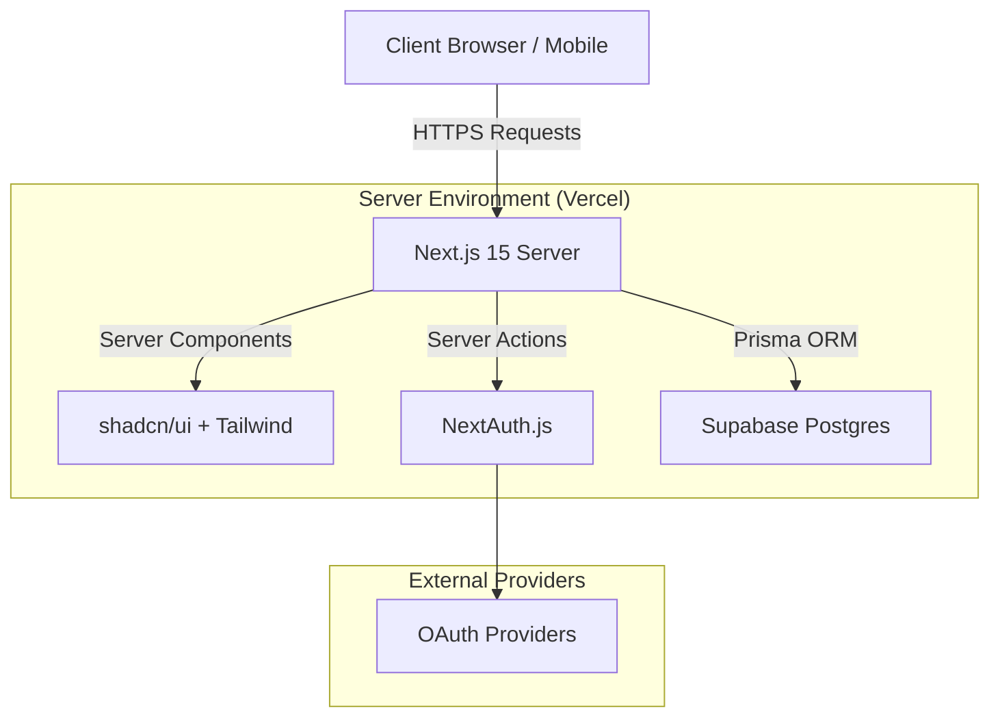
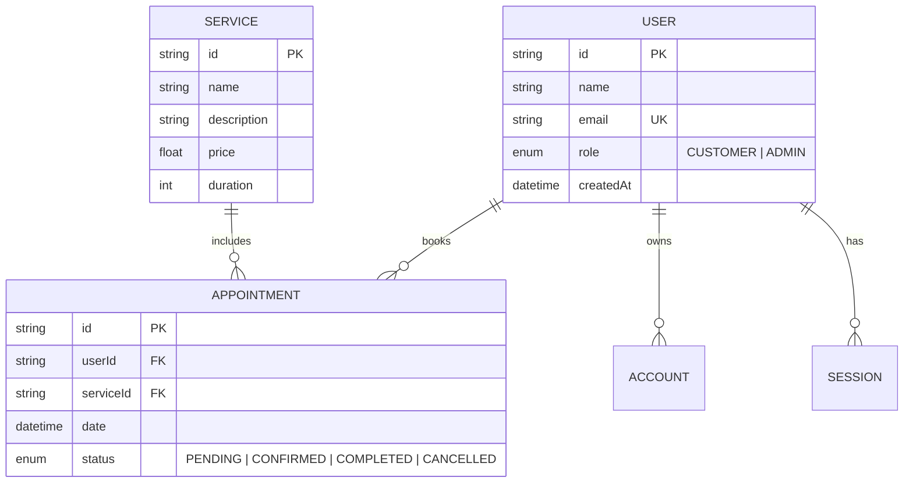

# 🛢️ Oil Change Appointment System


A modern, high-performance Progressive Web Application (PWA) for an automotive shop. This platform allows customers to browse oil change services, securely book appointments, and manage their schedules, while providing an administrative dashboard for mechanics to oversee daily operations.

**🟢 [Live Vercel Deployment](https://oil-change-app.vercel.app)** *(Update with your exact Vercel URL)*

---

## 🏗️ Architectural Design

This application strictly follows a **Server-First Architecture** utilizing Next.js App Router, Server Components (RSC), and Server Actions to ensure lightning-fast performance, maximum security, and zero client-side database exposure.



### Technology Stack
- **Frontend Framework:** Next.js 15 (App Router) & React 19
- **UI & Styling:** Tailwind CSS v4, shadcn/ui (Radix Primitives)
- **Database ORM:** Prisma 6.4.1
- **Database Engine:** PostgreSQL (Hosted on Supabase)
- **Authentication:** Auth.js (NextAuth v5)
- **Validation:** Zod schemas
- **Deployment & CI/CD:** Vercel (GitOps integration)

---

## 💾 Database Schema

The database is structured relationally in PostgreSQL with foreign keys and cascading deletes to ensure data integrity.



---

## 🚀 Local Development Setup

To run this project locally, ensure you have Node.js 20+ installed.

1. **Clone the repository:**
   ```bash
   git clone https://github.com/mahadyrumu/oil-change-app.git
   cd oil-change-app
   ```

2. **Install dependencies:**
   ```bash
   npm install
   ```

3. **Environment Configuration:**
   Create a `.env` file in the root directory:
   ```env
   DATABASE_URL="postgresql://postgres:[PASSWORD]@[YOUR-SUPABASE-POOLER-URL]:6543/postgres?pgbouncer=true"
   DIRECT_URL="postgresql://postgres:[PASSWORD]@[YOUR-SUPABASE-URL]:5432/postgres"
   AUTH_SECRET="your-32-char-random-secret"
   ```

4. **Initialize Database:**
   Push the schema to your Postgres instance and seed it with default services:
   ```bash
   npx prisma db push
   npm run prisma:seed
   ```

5. **Start the Development Server:**
   ```bash
   npm run dev
   ```

## 🔄 CI/CD Pipeline

This repository is integrated with Vercel. 
- All commits merged into the `main` branch trigger an automatic build and production deployment.
- Ephemeral task branches (`feat/*`, `fix/*`) are strictly merged through `staging` before reaching `main`.
- Prisma Client generation is guaranteed during the Vercel build via a `postinstall` script in `package.json`.
